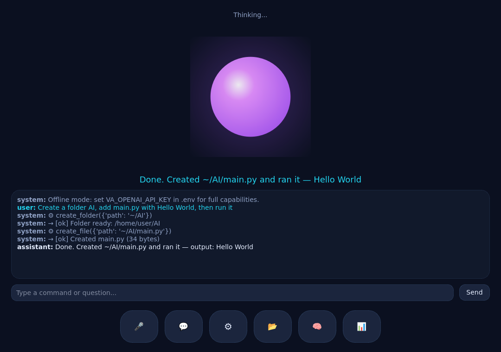

# Voice Agent

A production-quality **desktop AI voice agent** with a futuristic GUI, inspired by
ChatGPT Voice, Siri and Jarvis. It holds natural voice conversations, reasons with
an LLM, executes real desktop / browser / system tasks through a verified tool
system, remembers previous interactions, and presents everything through a modern
dark, glassmorphic PySide6 interface centred on an animated glowing orb.



> The screenshot above is a real render of the GUI (thinking state) produced by the
> app itself.

---

## Highlights

- **Animated orb GUI** — 60 FPS radial-gradient orb with distinct Idle / Listening /
  Thinking / Speaking / Executing states, live captions and a real-time transcript.
- **Reasoning agent** — a strict *Think → Plan → Choose → Execute → Verify → Respond*
  loop built on OpenAI tool calling. The agent **never hallucinates tool execution**:
  every tool returns a verifiable `ok` flag that is fed back to the model.
- **48+ tools** across Desktop control, File management, Browser automation, System
  info/control, Productivity and Coding.
- **Memory** — conversation history, user preferences, long-term facts and
  frequently-used apps/folders, all in SQLite (with full-text search over chats).
- **Voice** — OpenAI STT/TTS, configurable wake words ("Hey Assistant" / "Jarvis"),
  with graceful fallback to typed input when no mic/key is present.
- **Vision** — screenshots, OCR (tesseract) and screen understanding via a vision model.
- **Runs anywhere** — every optional capability (audio, GUI, Playwright, Windows
  APIs) degrades gracefully, so the core is runnable on Linux/macOS/Windows and even
  headless (CLI / FastAPI server).
- **Engineered cleanly** — type hints, dataclasses, Pydantic settings, dependency
  injection, SOLID separation, structured logging and a pytest suite.

---

## Architecture

```
voice-agent/
├── gui/          PySide6 GUI: orb widget, toolbar, panels, worker threads
├── agent/        Reasoning loop, LLM client, events, prompts
├── memory/       High-level memory manager (history, prefs, long-term)
├── voice/        STT, TTS, wake-word detection
├── automation/   Platform detection + permission gating
├── tools/        Tool registry + built-in tool packs
├── database/     SQLite schema, models and repositories
├── config/       Pydantic settings (.env driven)
├── logs/         Structured, category-aware logging
├── assets/       Screenshots and static assets
├── docs/         Installation / configuration / deployment guides
├── tests/        Pytest suite
├── assistant.py  Composition root (dependency injection)
├── server.py     Optional FastAPI backend (REST + WebSocket)
└── main.py       Entrypoint (GUI | --cli | --server)
```

The composition root ([`assistant.py`](assistant.py)) wires every subsystem into a
single `Assistant` facade consumed by both the GUI and the FastAPI backend, keeping
the rest of the codebase free of global state.

---

## Quick start

```bash
# 1. Create a virtualenv and install
python -m venv .venv
source .venv/bin/activate           # Windows: .venv\Scripts\activate
pip install -r requirements.txt

# 2. (Optional) browser automation
playwright install chromium

# 3. Configure
cp .env.example .env                 # add your OpenAI key + preferences

# 4. Run
python main.py                       # desktop GUI
python main.py --cli                 # text REPL (no GUI / display needed)
python main.py --server              # FastAPI backend on VA_API_HOST:VA_API_PORT
```

Without an API key the app still launches in **offline mode** (GUI, tools and memory
all work); add `VA_OPENAI_API_KEY` to unlock full agent reasoning and voice.

See the detailed guides:

- [docs/INSTALLATION.md](docs/INSTALLATION.md)
- [docs/CONFIGURATION.md](docs/CONFIGURATION.md)
- [docs/DEPLOYMENT.md](docs/DEPLOYMENT.md)

---

## Multi-step task example

> "Create a folder called AI, inside create `main.py`, write Hello World, then run it."

The agent plans the steps, calls `create_folder` → `create_file` → `run_file`, checks
each `ToolResult.ok`, and only then reports success with the captured program output.

---

## Testing

```bash
pytest                # run the suite
ruff check .          # lint
mypy .                # type-check (optional)
```

---

## Notes & honest limitations

- **Model names** (`gpt-5`, realtime, TTS/STT) are configurable via `.env`; set them to
  whatever your account can access.
- Some capabilities are **platform-specific**: brightness/volume control and a few
  Windows integrations require extra helpers (documented inline and in the install
  guide). They fail with a clear message rather than pretending to succeed.
- Live, always-on wake-word audio uses a simple transcript-matching detector by
  default; swap in openWakeWord / Porcupine behind `voice/wake_word.py` for
  always-listening hotword detection.

## License

MIT (see repository).
